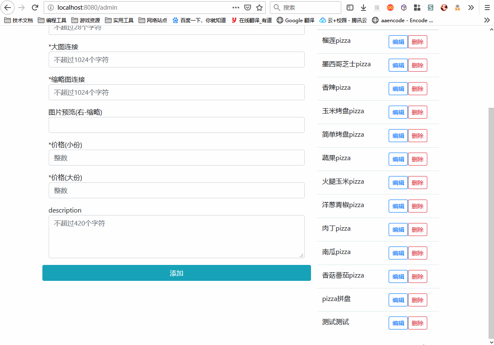

# pizza-fontend
## 简述
个人练习项目'pizza'的前端，后端[点此访问](https://github.com/ChaosAlphard/pizza-backend)

主要实现了对pizza的增删改查功能，购物车功能，用户的自动登录，对用户和管理分配不同的路由表

## 构成
- 构建工具
  - Vue-cli 3
- 框架
  - Vue.js
- 插件
  - Vuex
  - Vue-router
  - Axios
  - Bootstrap
  - ESLint
  - Babel

## 截图
添加

修改

删除

自动登录

对用户和管理分配不同的路由表

搜索

购物车
